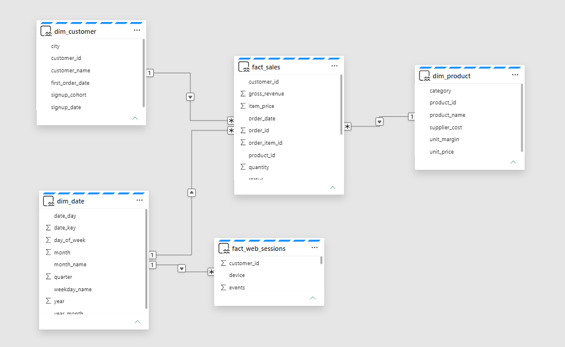
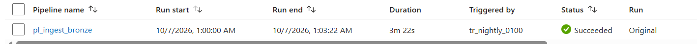
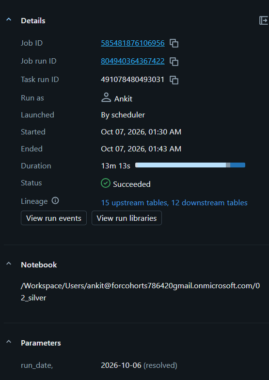
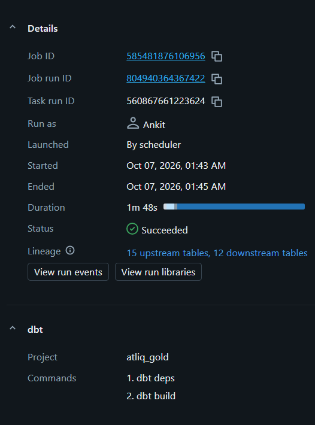
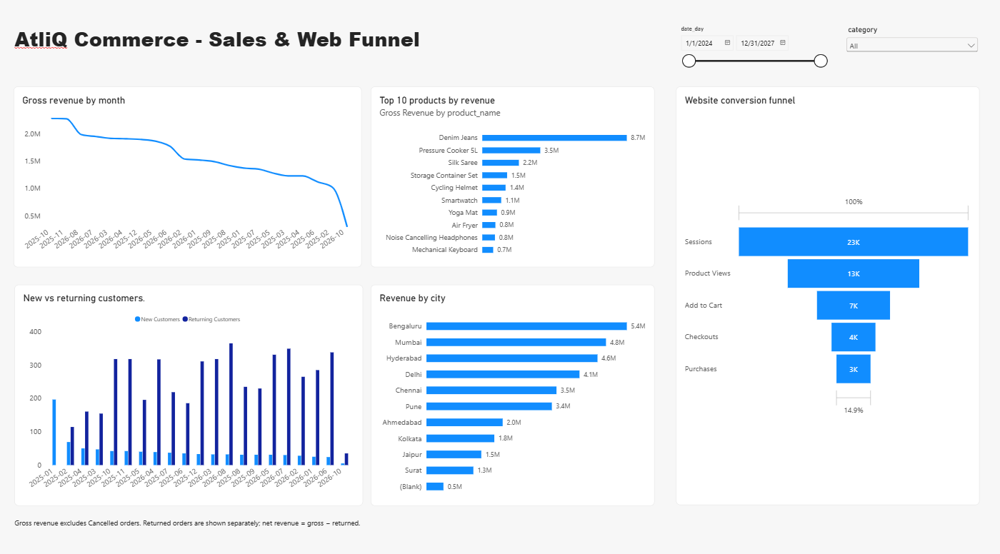
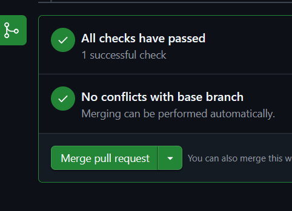
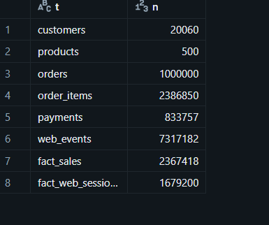

# AtliQ Commerce Data Pipeline


An end-to-end batch data engineering pipeline on Azure for AtliQ Commerce, an e-commerce business
that runs an operational SQL database alongside CSV and clickstream feeds.

Every night the pipeline lifts five OLTP tables and three file sources into a lakehouse, cleans and
conforms them, builds a tested star schema, and serves it to a Microsoft Fabric dashboard. It follows
the medallion architecture, loads incrementally using watermarks held in a control table, and is
designed to be idempotent at every layer.

Built as the capstone for the Codebasics Data Engineering Bootcamp.

---

## Table of contents

- [Architecture](#architecture)
- [Repository structure](#repository-structure)
- [Tech stack](#tech-stack)
- [Data model](#data-model)
- [Implementation walkthrough](#implementation-walkthrough)
  - [1. OLTP setup](#1-oltp-setup)
  - [2. Ingestion: Bronze (Azure Data Factory)](#2-ingestion-bronze-azure-data-factory)
  - [3. Transformation: Silver (Databricks)](#3-transformation-silver-databricks)
  - [4. Modelling: Gold (dbt Core)](#4-modelling-gold-dbt-core)
  - [5. Orchestration](#5-orchestration)
  - [6. Reporting (Microsoft Fabric)](#6-reporting-microsoft-fabric)
  - [7. CI and secrets](#7-ci-and-secrets)
- [Idempotency](#idempotency)
- [Timestamp consistency](#timestamp-consistency)
- [Checkpoint totals](#checkpoint-totals)
- [Data quality report](#data-quality-report)
- [Scale test](#scale-test)
- [Getting started](#getting-started)

---

## Architecture


```
Azure SQL Database          Azure Data Factory           ADLS Gen2 (Bronze)
  customers                   pl_ingest_bronze             bronze/<table>/
  products          ───────▶  metadata-driven,    ──────▶  ingest_date=YYYY-MM-DD/
  orders                      control-table                raw Parquet
  order_items                 driven
  payments
                                                                 │
Landing zone                                                     │
  supplier CSV      ───────▶  same pipeline       ──────▶        │
  marketing CSV                                                  │
  clickstream JSON                                               ▼

                                                   Databricks (Silver)
                                                     atliq.silver
                                                     Delta, MERGE on key
                                                     dq_log, quarantine
                                                                 │
                                                                 ▼
                                                   dbt Core (Gold)
                                                     atliq.gold
                                                     star schema plus tests
                                                     external Delta at .../gold
                                                                 │
                                                                 ▼
                                                   Microsoft Fabric
                                                     OneLake shortcut
                                                     Direct Lake semantic model
                                                     Power BI report
```

| Layer | Holds | Written by |
|---|---|---|
| Bronze | raw source data, exactly as extracted, in dated folders | ADF Copy activities |
| Silver | cleaned, conformed, deduplicated, still row-level and auditable | Databricks notebook |
| Gold | dimensional model, business logic applied, query-ready | dbt Core |

### Why the OLTP and OLAP sides are split

The operational database is normalised for fast, conflict-free writes. An order insert touches one
small row in `orders` and a few in `order_items`, with no duplicated data to keep in sync.

Analytics wants the opposite shape: wide, denormalised rows that scan quickly. Pointing the dashboard
straight at `atliq_commerce` would mean five-table joins on every page load, competing with checkout
traffic for the same CPU: slow reports *and* slow checkouts. The star schema in `atliq.gold` does that
join work once per night instead of once per query.

---

## Repository structure

```
atliq-commerce-data-pipeline/
├── sql/                         OLTP schema (3NF), seed data, etl.control_table,
│                                etl.usp_update_watermark (run in numbered order)
├── python/                      daily_order_simulator.py, .env.example
├── adf/                         ARM template export: pipeline, datasets,
│                                linked services, trigger
├── databricks/
│   ├── 00_setup.py              catalog and schemas
│   ├── 01_profile_bronze.py     profiling before any cleaning code
│   └── 02_silver.py             the nightly Silver build
├── atliq_gold/                  dbt project
│   ├── models/staging/          sources.yml plus 7 staging models
│   ├── models/gold/             5 marts plus schema.yml tests
│   ├── dbt_project.yml
│   └── profiles.yml             env_var() references only
├── audit/                       checkpoint and data quality queries, exported report
├── scale_up_results/            100× scale test: notebook, manifest, run evidence
├── fabric_analytics/            semantic model and dashboard screenshots
├── docs/                        dashboard, nightly run, CI, idempotency proof
├── .github/workflows/ci.yml     dbt build and tests on every pull request
├── atliq_commerce_architecture.svg
└── requirements.txt
```

---

## Tech stack

| Layer | Technology |
|---|---|
| OLTP source | Azure SQL Database (`atliq_commerce`) |
| Ingestion and orchestration | Azure Data Factory (`adf-atliq-ankit`) |
| Storage | Azure Data Lake Storage Gen2 (`atliqlakeankit`, container `lakehouse`) |
| Processing | Azure Databricks, PySpark, Delta Lake, Unity Catalog |
| Modelling | dbt Core 1.12 with `dbt-databricks` |
| Serving | Microsoft Fabric Lakehouse, Direct Lake semantic model, Power BI |
| CI | GitHub Actions |
| Language | Python, SQL |

All Azure resources sit in one resource group in Central India.

---

## Data model

### OLTP, normalised for writing

Five tables in third normal form: `customers`, `products`, `orders`, `order_items`, `payments`.

### Silver, a faithful copy with cleaning applied

`atliq.silver` holds `customers`, `products`, `orders`, `order_items`, `payments`,
`supplier_price_list`, `marketing_spend`, `web_events`, `web_events_quarantine` and `dq_log`.
Nothing is deleted from the source picture; bad rows are flagged, quarantined or logged.

### Gold, a star schema for reading



| Table | Grain | Key columns |
|---|---|---|
| `fact_sales` | one row per order item | `order_item_id`, `quantity × item_price = gross_revenue`, `status` |
| `fact_web_sessions` | one row per web session | `session_id`, `session_date`, four funnel flags |
| `dim_customer` | one row per customer | city, signup cohort, first order date |
| `dim_product` | one row per product | category, unit price, supplier cost, unit margin |
| `dim_date` | one row per day | generated from 2024-01-01 to 31 December of next year, so it rolls forward on its own |

---

## Implementation walkthrough

### 1. OLTP setup

`sql/01`–`06` build the normalised schema and load seed data. `sql/07_etl_control_table.sql` creates
the ETL metadata: `etl.control_table`, which declares how each table is loaded, and
`etl.usp_update_watermark`, which advances a table's watermark after a successful copy.

| table_name | source_schema | load_type | watermark_column |
|---|---|---|---|
| customers | dbo | full | |
| products | dbo | full | |
| orders | dbo | incremental | `updated_at` |
| order_items | dbo | incremental | `created_at` |
| payments | dbo | incremental | `updated_at` |

Orders and payments can change after they are written, for example when a status moves from Placed
to Delivered, so they are tracked by `updated_at`. Line items never change once written, so
`order_items` uses `created_at`. The two small reference tables are reloaded in full each night,
which is cheaper than tracking changes at this size.

`python/daily_order_simulator.py` generates fresh transactions so the incremental path has something
to find:

```bash
python python/daily_order_simulator.py --orders 20 --update-existing 5
```

### 2. Ingestion: Bronze (Azure Data Factory)

One pipeline, `pl_ingest_bronze`, handles every source table. It contains no table names, because it
reads them from the control table:

```
Set run start  (captures run_start_at once, so every table shares one timestamp)
Lookup control table  (SELECT * FROM etl.control_table)
   │
   └── For each source (sequential)
          │
          ├── Is incremental?
          │      ├── true  →  Copy incremental
          │      │            WHERE <watermark_column> > '<last_loaded_at>'
          │      │            →  bronze/<table>/ingest_date=<run date>/
          │      │
          │      └── false →  Copy full
          │                   →  same dated path
          │
          └── Advance watermark  (etl.usp_update_watermark @table_name, @run_start_at)

Get CSV files → Filter CSV → For each CSV → Copy CSV     (supplier and marketing files)
Copy clickstream                                          (JSON lines)
```

Onboarding a sixth source table is an `INSERT` into `etl.control_table`: no pipeline change, no new
activity, no redeploy.

**Dated partitions.** Every load writes to `bronze/<table>/ingest_date=YYYY-MM-DD/`, so a same-day
retry overwrites its own folder rather than appending beside it.

**Raw, untouched Parquet.** No transformation happens in ADF. Bronze is a replayable record of what
the source said on a given night, so Silver can always be rebuilt from it.

### 3. Transformation: Silver (Databricks)

`databricks/02_silver.py` takes a `run_date` widget, reads that night's Bronze partition, and writes
Delta tables to `atliq.silver`.

**Conforming variant spellings.** Status, city, category, payment method and marketing channel arrive
with inconsistent casing, spacing and abbreviations. Lookup maps keyed on a normalised form (trim,
lowercase, collapse spaces) resolve them. Anything unmapped becomes NULL deliberately, so the dbt
tests catch a new spelling instead of letting it through silently.

**Extracting amounts, not stripping them.** Supplier cost, marketing spend and clicks arrive in the
CSVs as text such as `Rs. 1202.45` or `1,202.45`. Stripping non-digits turns `Rs. 1202.45` into `.1202.45`, which fails to parse and
disappears from every total without an error. `regexp_extract` on the numeric pattern keeps the value.

**Delta MERGE on the business key.** Facts are merged, never appended:

```python
(DeltaTable.forName(spark, "atliq.silver.orders").alias("t")
    .merge(src.alias("s"), "t.order_id = s.order_id")
    .whenMatchedUpdateAll(condition="s.updated_at > t.updated_at")
    .whenNotMatchedInsertAll()
    .execute())
```

The `s.updated_at > t.updated_at` condition stops an older batch overwriting a newer row. Before the
merge, a window function keeps the latest version of each order within the batch, because one night's
extract can contain two versions of the same order. `payments` merges the same way;
`order_items` is insert-only, since line items never change.

**Surviving a quiet night.** If nothing changed, ADF lands no files and `spark.read.parquet` would
raise PATH_NOT_FOUND. Each incremental table is guarded, so the job succeeds and Silver stays as it
was:

```python
if not batch_exists(src_path):
    print(f"No new orders batch for {run_date}: Silver unchanged.")
else:
    ...  # the MERGE
```

`batch_exists()` returns False only for a missing path; any other error, such as a permissions
failure, still fails the run.

**Clickstream parsing with quarantine.** JSON lines are read as raw text and parsed with an explicit
schema. Unparseable lines go to `atliq.silver.web_events_quarantine` instead of failing the job. Bot
traffic is removed by *session*, not by event, because a crawler's page views would inflate every
stage of the funnel.

**Flagging rather than deleting.** QA test accounts (`@atliq-test.com`) get an `is_test` flag. They
stay in Silver and are filtered out one layer later, in dbt staging.

**Every rule logs what it did:**

```python
def log_dq(table_name, rule, rows_affected):
    (spark.createDataFrame([(run_date, table_name, rule, int(rows_affected))],
        "run_date STRING, table_name STRING, rule STRING, rows_affected LONG")
        .write.mode("append").saveAsTable("atliq.silver.dq_log"))
```

### 4. Modelling: Gold (dbt Core)

Silver is declared as a dbt source. Thin staging models sit on top, where business duplicates are
resolved:

```sql
-- stg_payments.sql: keep the first payment when the gateway retried
SELECT payment_id, order_id, amount, method, paid_at
FROM {{ source('silver', 'payments') }}
QUALIFY ROW_NUMBER() OVER (PARTITION BY order_id ORDER BY paid_at, payment_id) = 1
```

The same pattern drops double-submitted line items (`stg_order_items`) and collapses the supplier's
price history to the current cost (`stg_supplier_price_list`).

Marts are table materialisations, rebuilt in full from Silver each night. That is correct because
Silver already holds the merged history, and it makes Gold idempotent by construction. They are
written as external Delta tables under `location_root`:

```yaml
models:
  atliq_gold:
    gold:
      +materialized: table
      +location_root: "abfss://lakehouse@atliqlakeankit.dfs.core.windows.net/{{ target.schema }}"
```

Tests run as part of every `dbt build`, not as a separate step. Eight of them:

| Model | Column | Test |
|---|---|---|
| `fact_sales` | `order_item_id` | unique, not_null |
| `fact_sales` | `customer_id` | relationships → `dim_customer` |
| `fact_sales` | `product_id` | relationships → `dim_product` |
| `fact_sales` | `order_date` | relationships → `dim_date.date_day` |
| `fact_sales` | `status` | accepted_values: Placed, Shipped, Delivered, Cancelled, Returned |
| `fact_web_sessions` | `session_id` | unique, not_null |

A broken relationship or an unmapped status fails the nightly job instead of reaching the dashboard.

### 5. Orchestration

| Time (IST) | Component | Duration |
|---|---|---|
| 01:00 | ADF trigger `tr_nightly_0100` fires `pl_ingest_bronze` | 3m 22s |
| 01:30 | Databricks `job_nightly`, task `silver` (`02_silver`) | 13m 13s |
| 01:43 | Databricks `job_nightly`, task `gold` (`dbt deps`, `dbt build`) | 1m 48s |

A full green run of 7 October 2026, end to end in about 18 minutes:

| | |
|---|---|
|  | `pl_ingest_bronze`, triggered by `tr_nightly_0100`, Succeeded |
|  | `02_silver`, launched by scheduler, `run_date` resolved |
|  | dbt project `atliq_gold`, `dbt deps` then `dbt build`, Succeeded |

Per-stage timings are in [`docs/pipeline_timings.pdf`](docs/pipeline_timings.pdf).

The Silver task receives `run_date` as `{{job.start_time.iso_date}}`, so the notebook resolves its own
Bronze partition. No date is hardcoded anywhere in the chain.

**Both sides agree on UTC, which matters more than it looks.** The ADF trigger is scheduled in India
Standard Time, but `run_start_at` is `@utcNow()`, so a 01:00 IST run lands Bronze in
`ingest_date=2026-10-06`. The Databricks job starting at 01:30 IST resolves `run_date` to the same
`2026-10-06`. Had one side used local time, Silver would have looked for a folder that did not exist
and quietly reported "Silver unchanged" every night, with no error anywhere.

The job emails on failure: a dashboard that is silently stale is worse than one that is visibly down.

### 6. Reporting (Microsoft Fabric)

A OneLake shortcut points a Fabric Lakehouse at the Gold path in ADLS, so no data is copied. A Direct
Lake semantic model sits on it, with relationships from each dimension to `fact_sales` and from
`dim_date` to `fact_web_sessions`, so one date slicer filters both revenue and funnel.



Five visuals (gross revenue by month, top 10 products, revenue by city, new versus returning
customers, and the website conversion funnel) with date and category slicers.

**Revenue definition, stated on the page:** gross revenue excludes Cancelled orders, Returned orders
are shown separately, and net revenue is gross minus returned.

### 7. CI and secrets

`.github/workflows/ci.yml` runs `dbt deps && dbt build --target ci` on every pull request, using
repository secrets for the Databricks connection. The `ci` target writes to a throwaway `atliq.ci`
schema, and because `location_root` interpolates `{{ target.schema }}`, its files land in `.../ci` and
can never overwrite the production Gold that Fabric reads. CI still reads the real Silver tables, so
models are tested against real data.



`profiles.yml` holds only `env_var()` references and is safe to commit. Real values live in GitHub
Actions secrets and in a git-ignored `.env`; `python/.env.example` documents the keys without values.

---

## Idempotency

Three mechanisms, one at each layer:

| Layer | Mechanism | What a re-run does |
|---|---|---|
| Bronze | dated partitions | overwrites the same folder |
| Silver | Delta MERGE on the business key | updates matched rows, never inserts twice |
| Gold | full rebuild from Silver | recomputes the same output |

The check: run this query, re-run the entire nightly chain with no simulator activity in between,
and run it again. The two results must be identical.

```sql
SELECT COUNT(*)           AS fact_rows,
       SUM(gross_revenue) AS total_gross_revenue
FROM atliq.gold.fact_sales;
```

Result after the re-run: **23,054 rows, 39,692,034.00**
([`docs/idempotency_proof_run2.png`](docs/idempotency_proof_run2.png)). These figures cover all orders
and all statuses, including those the simulator added after the seed period, which is why they differ
from the seed-period checkpoint figures below.

---

## Timestamp consistency

Three different time concepts run through this pipeline, and mixing them up is a common source of
quiet errors:

| Concept | Column | Used for |
|---|---|---|
| When the business event happened | `order_date`, `event_ts` | analytics and date dimension joins |
| When the row last changed | `updated_at`, `created_at` | incremental extraction watermarks |
| When the pipeline collected it | `ingest_date` folder | partitioning and replay |

Web sessions are dated by `event_ts`, not by the file they arrived in, so a late-arriving event lands
in a later night's batch but still counts on the day it happened. Orders whose `order_date` is a
placeholder `1900-01-01` fall back to `created_at` during cleaning.

---

## Checkpoint totals

Measured on the seed period (`order_date <= 2026-08-31`) against the figures in the project brief.
**All checks match.**

| Check | Expected | Result | |
|---|---|---|---|
| Customers (excluding QA test accounts) | 1,000 | 1,000 | ✅ |
| Distinct cities | 10 | 10 | ✅ |
| Products | 60 | 60 | ✅ |
| Product categories | 6 | 6 | ✅ |
| Orders (excluding test accounts) | 9,961 | 9,961 | ✅ |
| Placed | 47 | 47 | ✅ |
| Shipped | 102 | 102 | ✅ |
| Delivered | 6,838 | 6,838 | ✅ |
| Cancelled | 1,778 | 1,778 | ✅ |
| Returned | 1,196 | 1,196 | ✅ |
| Order items in `fact_sales` | 22,959 | 22,959 | ✅ |
| Payments (one per paid order) | 8,183 | 8,183 | ✅ |
| Payments total | 32,424,661.00 | 32,424,661.00 | ✅ |
| Gross revenue (excluding Cancelled) | 32,424,661.00 | 32,424,661.00 | ✅ |
| Returned revenue | 4,574,944.00 | 4,574,944.00 | ✅ |
| Net revenue (gross minus returned) | 27,849,717.00 | 27,849,717.00 | ✅ |
| Supplier current cost rows | 60 | 60 | ✅ |
| Supplier current cost total | 56,871.53 | 56,871.53 | ✅ |
| Marketing rows after cleaning | 3,037 | 3,037 | ✅ |
| Marketing spend | 8,920,850.16 | 8,920,850.16 | ✅ |
| Marketing clicks | 3,274,996 | 3,274,996 | ✅ |
| Clickstream quarantined | 426 | 426 | ✅ |
| Clickstream clean events | 93,436 | 93,436 | ✅ |
| Sessions | 23,193 | 23,193 | ✅ |
| Funnel: product view / cart / checkout / purchase | 13,309 / 7,391 / 4,442 / 3,446 | same | ✅ |

Payments reconcile to gross revenue exactly, 32,424,661.00 from both directions. That identity only
holds once retried payments, double-submitted line items and QA test accounts are each handled
correctly, so it validates the whole cleaning layer in a single number. The verification queries,
each carrying its expected value as a comment, are in
[`audit/checkpoint_totals.sql`](audit/checkpoint_totals.sql).

---

## Data quality report

Rows affected per cleaning rule, from `atliq.silver.dq_log`. Export in
[`audit/dq_report.csv`](audit/dq_report.csv), queries in [`audit/dq_queries.sql`](audit/dq_queries.sql).

| Table | Rule | Rows affected |
|---|---|---|
| customers | test accounts flagged | 56 |
| marketing_spend | blank-spend rows dropped | 102 |
| marketing_spend | exact duplicate rows removed | 324 |
| supplier_price_list | exact duplicate rows removed | 24 |
| supplier_price_list | rows for unknown products dropped | 18 |

Worth watching over time: a rule whose count jumps suddenly is an early signal that a source system
changed, before it shows up as a wrong number on the dashboard.

---

## Scale test

The seed dataset is small enough that a pipeline can pass on it by accident. To check the design
rather than the data volume, the OLTP database was regenerated at roughly 100× and the entire chain
re-run unchanged: no code edits, no tuning, no new activities.

| | Seed | Silver (raw) | Gold (filtered) |
|---|---|---|---|
| Customers | 1,000 | 20,060 | 20,000 |
| Products | 60 | 500 | 500 |
| Orders | 9,961 | 1,000,000 | 996,038 |
| Order items | 22,959 | 2,386,850 | 2,367,418 |
| Payments | 8,183 | 833,757 | 818,178 |
| Web events | 93,436 | 7,317,182 | 7,317,182 |
| Web sessions | 23,193 | — | 1,679,200 |



**Why the two columns differ.** Silver is a faithful copy of the source, so it keeps QA test accounts
with an `is_test` flag rather than deleting them. They are filtered out one layer later, in
`stg_orders`. At this scale 60 test customers carried 3,962 orders, 19,432 line items and 15,579
payments, and that is the entire gap between the columns. Products and web events are not
customer-scoped, so they are identical in both.

The filtered figures are the ones in
[`scale_up_results/scale_manifest.json`](scale_up_results/scale_manifest.json), and they match the
Gold tables exactly: manifest `order_items` equals `fact_sales` at 2,367,418, and `web_sessions`
equals `fact_web_sessions` at 1,679,200. The screenshot above lists the raw Silver counts alongside
those two Gold tables, which is why its first rows are the larger numbers.

**The reconciliation identity survives.** Payments total and gross revenue excluding Cancelled both
come to **6,051,157,102.00**. Agreement at a million orders means the dedup logic in `stg_payments`
and `stg_order_items` is holding under genuine duplicate volume, not passing on a lucky sample.

Evidence in [`scale_up_results/`](scale_up_results/): the generator notebook, `scale_manifest.json`
with every total, run screenshots for the ADF, Silver, dbt and job stages, and query wall-clock
timings. The notebook reads its SQL credentials from a Databricks secret scope, so nothing is
hardcoded.

---

## Getting started

### Prerequisites

Python 3.11 or later, an Azure subscription, a Databricks workspace with Unity Catalog, and a
Microsoft Fabric or Power BI workspace.

```bash
git clone https://github.com/Ankit-Anshu/atliq-commerce-data-pipeline
cd atliq-commerce-data-pipeline
pip install -r requirements.txt
```

### 1. OLTP

Run `sql/01_schema_ddl.sql` through `sql/07_etl_control_table.sql` against your Azure SQL database in
numbered order. Copy `python/.env.example` to `python/.env` and fill in your connection details.

```bash
python python/daily_order_simulator.py --orders 20
```

### 2. Bronze

Deploy `adf/ARMTemplateForFactory.json` to a Data Factory, supply the linked-service parameters
(SQL password, ADLS account key), and publish. Trigger `pl_ingest_bronze` manually to verify, then
start `tr_nightly_0100`.

### 3. Silver

Import `databricks/` into your workspace. Run `00_setup` once to create the catalog and schemas, then
run `02_silver` with a `run_date` widget value matching a Bronze `ingest_date` folder.

### 4. Gold

```bash
cd atliq_gold
export DATABRICKS_HOST=...        # server hostname, no https://
export DATABRICKS_HTTP_PATH=...   # /sql/1.0/warehouses/<id>
export DATABRICKS_TOKEN=...
dbt debug
dbt build                         # 12 models, 8 tests
```

### 5. Nightly automation

Create a Databricks job with two tasks: the `02_silver` notebook with `run_date` set to
`{{job.start_time.iso_date}}`, then a dbt task pointing at `atliq_gold` in this repository. Schedule
it for 01:30 IST, after the ADF trigger, and add a failure email notification.

---

## Author

**Ankit Anshu** · [GitHub](https://github.com/Ankit-Anshu) · Codebasics Data Engineering Bootcamp
capstone
